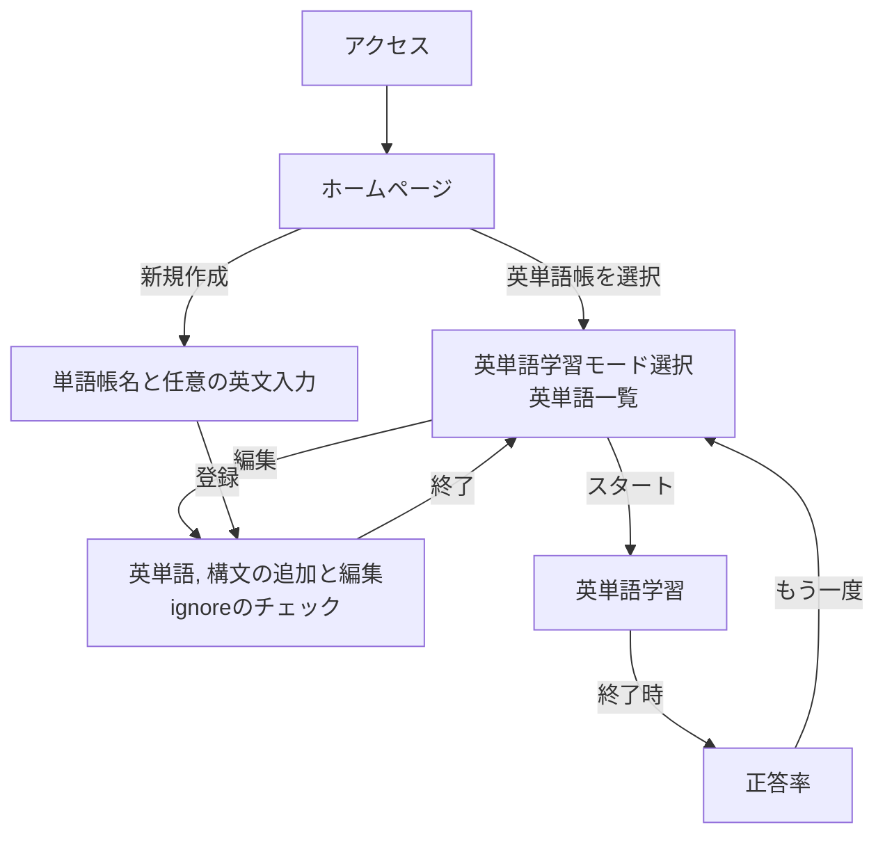
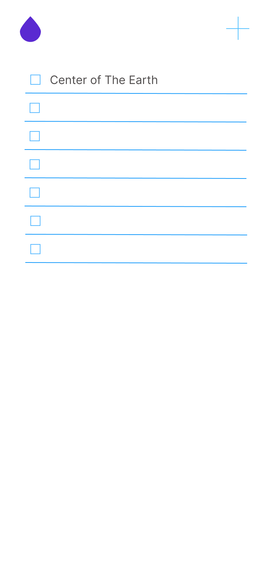
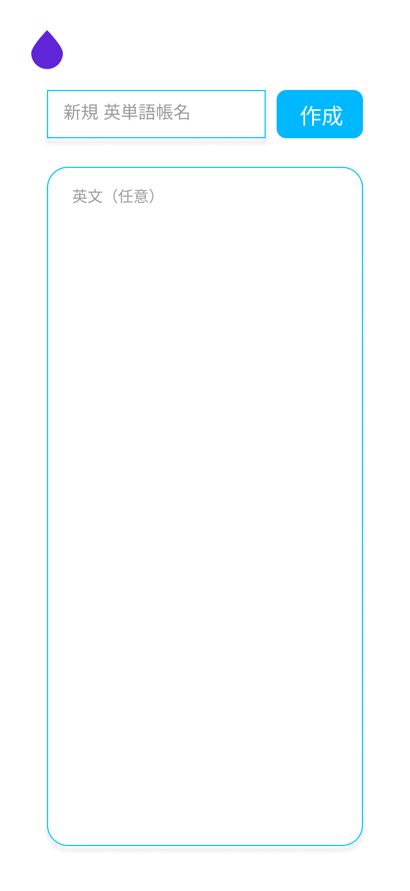
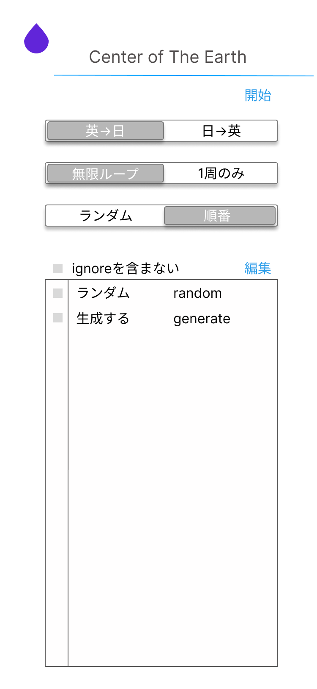
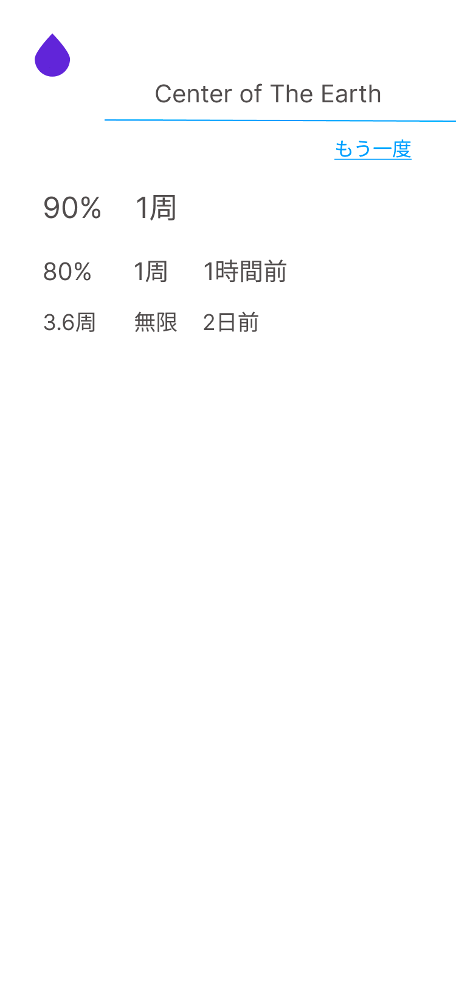
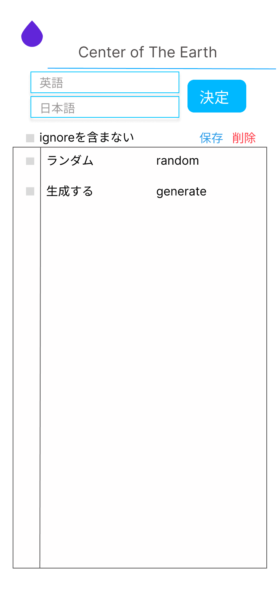

# English-Word

## 仕様書
### 概要
英文から英単語を抜き出し、自動で英単語帳を作成する。

### シナリオ

#### シナリオ1: レッサー
レッサーは英語の勉強に励む学生である。彼はタイピングが得意で試験前には教科書の英文を全て打ち出し、翻訳したり、それを再度英文に直したりして勉強を行う。
また、英文は事前にわからない単語がないように全ての知らない単語を抜き出し徹底的に覚える。この時彼は辞書で全ての英単語と構文を一つ一つ調べていく。一つ一つ知らない単語を表ソフトに打ち出し、隣に英語の役を書いていくのおなじみだ。

#### シナリオ2: パン
パンは英単語がとにかく覚えていない学生である。彼女は英単語をほとんど知らないので、他の人にとっては常識的な英単語も覚えなければならない対象である。
彼女は他の人が知っている単語でも知らない単語として単語帳に載せなけれbならない。

### 対象外
このバージョンで以下の機能はサポートしない

- ユーザによるアカウントの作成
- 単語帳の共有範囲の制限
- 英文の再度アップロード
- 英単語のタイピングによる試験
- PCでの英単語帳学習

### creaidea.infoのフローチャート

### 画面ごとの仕様

#### ホームページ

ホームアイコンが左上に存在し、そこを押せばいつだってホームページに戻ってこれる。

- 新規英単語帳作成
- 英単語帳一覧

があり、それぞれページ遷移となる。英単語長一覧は、最近使用されたものから順に並んでいる

#### 単語帳と任意の英文入力

単語帳名の入力欄（最大文字数255文字）と英文の入力エリア（最大文字数5万文字)と登録ボタンがある。

単語帳名は必須入力であり、英文入力は任意入力である。単語帳名が入力されており、かつ既存の英単語長に同名のものがない場合、登録ボタンを押すことができる。

#### 英語学習モード選択と英単語一覧

英語学習モードとして

- 日本語→英語
    - ランダム
      - 問題数指定
      - 一周のみ
      - 無限ループ
    - 出てくる順
      - 一周のみ
      - 無限ループ
- 英語→日本語
  - ランダム
    - 問題数指定
    - 一周のみ
  - 無限ループ
    - 出てくる順
    - 一周のみ
    - 無限ループ

が存在する。ランダムモードでは、ランダムに問題が並べ替えられ、出てくる順ではその単語が一致する最初の場所が英文の中で早い方が先となる。同一（語句と単語）ならば短い単語の方が優先される。

一周のみの場合、それぞれの単語・語句は一度しか出てこないが、無限ループでは、間違えた問題は最後に追加されていき、全ての問題を正解しないと終わらない

モード選択は、同一階層で一つのみ選べる選択ボタンとなっている。

英単語一覧は、表で表示される。ignoreに含まれている単語を表示するか（フィルタ）どうかをボタンで変更できる

表の近くに編集ボタンが存在し、そこを押すと編集用のViewにとぶ

スタートボタンを押すと、指定された選択モードで英語学習Viewにとぶ

#### 英語学習

単語・語句が表示される。画面をタップすると答えの表示。画面を右スワイプで正解として次の単語へ、下スワイプで不正解として次のスライドへ。上or左にスワイプで前回の問題へ（再度成功失敗が選択可能）

デフォルトで答えは表示されず、英語と日本語どちらの表示となるかはモードで決まる。

残り問題数と全体問題数と現在の正答率が表示される。無限ループモードでは正答率が100%になると終了する

#### 正答率

過去の問題の正答率（終了に必要な問題数）なども表示される。

チャレンジ人数とその平均正答率、順位も表示される

#### 英単語帳編集

英単語帳の名前を変更可能

ignoreを含むか含まないかを指定可能な英単語一覧表を表示。PCとスマホにここだけレスポンシブ対応する

保存ボタンを押さない限り、保存はされない。また保存は全ての情報が適切に（漏れがない）状態出ないと押せない。

新規英単語、語句を追加可能。

新規英単語を入力して翻訳ボタンを押すと、自動で日本語を補完される。

⌘+sで保存する。`

### デザイン案

[Figmaで作成したデザイン](https://www.figma.com/file/vLdS9awL3kzWZqt5h4hTrx/%E8%8B%B1%E5%8D%98%E8%AA%9E%E3%82%A2%E3%83%97%E3%83%AA)
